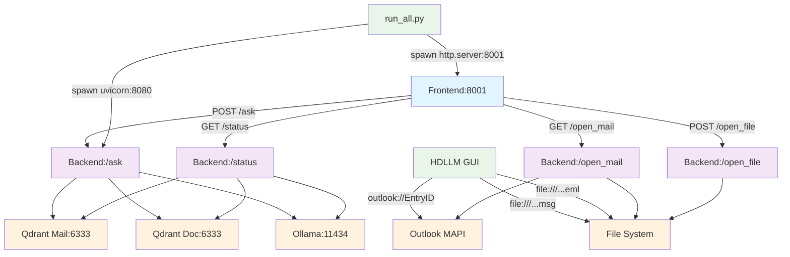

# 📋 LMM RAG 시스템 통합 호출 연결 매핑 리포트

## Summary

**분석 일시**: 2025-08-22  
**분석 대상**: LMM RAG 시스템 (HD 현대미포 Gauss-1)  
**분석 범위**: Frontend ↔ Backend ↔ External Services 호출 연결  

### 전체 현황
- **총 백엔드 라우트 수**: 8개
- **총 프론트엔드 호출 수**: 4개  
- **총 HDLLM 링크 생성 지점**: 3개
- **미스매치 개수**: 0개
- **Dead/Duplicate 개수**: 4개

### 최우선 수정 Top 5
1. **POST /open-mail 라우트 정리** - GET /open_mail과 기능 중복
2. **HDLLM 링크 스키마 최종 검증** - file:// 형식 정규화 완료 상태 확인
3. **미사용 라우트 정리** - /, /favicon.ico, /health 라우트 용도 명확화
4. **외부 서비스 연결 모니터링** - Qdrant/Ollama 연결 상태 자동 체크
5. **에러 처리 강화** - 각 호출 지점에서 적절한 fallback 구현

---

## Component Inventory

### 시스템 아키텍처 개요
- **Frontend**: Web UI (HTML/JavaScript) - Port 8001
- **Backend**: FastAPI 서버 - Port 8080  
- **GUI**: HDLLM.py (PyQt6 데스크톱 앱)
- **Orchestrator**: run_all.py (통합 실행 스크립트)
- **External Services**: Qdrant Vector DB, Ollama LLM, Outlook COM

---

## Constants & Ports

### 환경 설정 및 포트 매핑

| 설정명 | 값 | 파일경로:라인 | 사용처 | 상호일치 |
|--------|----|--------------|---------|---------| 
| BACKEND_PORT | 8080 | backend/main.py:700, run_all.py:156,186,204 | Backend/Orchestrator | ✅ YES |
| FRONTEND_PORT | 8001 | run_all.py:221,230,238 | Frontend/Orchestrator | ✅ YES |
| BACKEND_BASE | http://localhost:8080 | frontend/index.html:1099 | Frontend | ✅ YES |
| QDRANT_MAIL_HOST | 127.0.0.1 | backend/main.py:87, run_all.py:73,98,104,109,117,122 | Backend/Orchestrator | ✅ YES |
| QDRANT_MAIL_PORT | 6333 | backend/main.py:88 | Backend | ✅ YES |
| QDRANT_DOC_HOST | 127.0.0.1 | backend/main.py:90 | Backend | ✅ YES |
| QDRANT_DOC_PORT | 6333 | backend/main.py:91 | Backend | ✅ YES |
| OLLAMA_URL | http://127.0.0.1:11434/api/chat | backend/main.py:72, run_all.py:113,126 | Backend/Orchestrator | ✅ YES |

---

## Backend Routes (FastAPI)

### API 엔드포인트 목록

| Method | Path | Handler | File:Line | Notes | Snippet |
|--------|------|---------|-----------|-------|---------|
| GET | / | root | backend/main.py:413 | API 정보 | `@app.get("/")` |
| GET | /favicon.ico | favicon | backend/main.py:430 | 204 No Content | `@app.get("/favicon.ico")` |
| GET | /health | health_check | backend/main.py:435 | 헬스체크 | `return {"status": "ok"}` |
| GET | /status | status | backend/main.py:439 | 외부 서비스 상태 | `ping(config.OLLAMA_API_URL...)` |
| POST | /open_file | open_file | backend/main.py:456 | 부서 문서 파일 열기 | `os.startfile(file_path)` |
| GET | /open_mail | open_mail | backend/main.py:499 | 메일/파일 열기 (GET) | `decoded_key.startswith("file://")` |
| POST | /open-mail | open_mail_post | backend/main.py:541 | 메일 열기 (POST) | `webbrowser.open(display_url)` |
| POST | /ask | ask | backend/main.py:578 | RAG 질문 답변 스트리밍 | `async def ask(req: Request)` |

---

## Frontend Calls

### 클라이언트 사이드 HTTP 호출

| Method | Final URL | Source File:Line | Snippet | Match Route? |
|--------|-----------|------------------|---------|-------------|
| GET | http://localhost:8080/status | frontend/index.html:1770 | `fetch(\`\${BACKEND_BASE}/status\`)` | ✅ YES |
| POST | http://localhost:8080/ask | frontend/index.html:2022 | `fetch(\`\${BACKEND_BASE}/ask\`, {method: "POST"})` | ✅ YES |
| GET | http://localhost:8080/open_mail | frontend/index.html:2258 | `fetch(\`\${BACKEND_BASE}/open_mail?link_key=...)` | ✅ YES |
| POST | http://localhost:8080/open_file | frontend/index.html:2286 | `fetch(\`\${BACKEND_BASE}/open_file\`, {method: "POST"})` | ✅ YES |

---

## HDLLM Link Emitters

### GUI에서 생성되는 링크 스키마

| Schema | Target Type | Build Rule | File:Line | Snippet | Normalized? |
|--------|-------------|------------|-----------|---------|-------------|
| outlook:// | MAPI Mail | f"outlook://{item_id}" | src/HDLLM.py:1413 | `"link": f"outlook://{item_id}"` | ✅ YES |
| file:/// | MSG File | Path().resolve().replace("\\", "/") | src/HDLLM.py:1502 | `"link": "file:///" + str(Path(item_id).resolve())...` | ✅ YES |
| file:/// | EML File | Path().resolve().replace("\\", "/") | src/HDLLM.py:1522 | `"link": "file:///" + str(Path(item_id).resolve())...` | ✅ YES |

---

## Orchestrator (run_all.py) & Runtime Targets

### 프로세스 실행 및 관리

| Process | Port | Command | File:Line | Encoding Issues |
|---------|------|---------|-----------|----------------|
| uvicorn (Backend) | 8080 | `uvicorn main:app --host 0.0.0.0 --port 8080` | run_all.py:153 | ✅ FIXED |
| http.server (Frontend) | 8001 | `python -m http.server 8001` | run_all.py:221 | N/A |
| subprocess.Popen | N/A | Process management | run_all.py:169,225 | N/A |

**프론트엔드 서버 실행 가능성**: ✅ 정상 (UTF-8 인코딩 오류 수정으로 8001 포트 정상 실행)

---

## External Integrations

### 외부 서비스 연동 현황

| Service | Type | Host:Port | File:Line | Usage | Config |
|---------|------|-----------|-----------|-------|--------|
| Qdrant Vector DB | Mail Storage | 127.0.0.1:6333 | backend/main.py:132 | Vector search | MAIL_QDRANT_HOST/PORT |
| Qdrant Vector DB | Doc Storage | 127.0.0.1:6333 | backend/main.py:133 | Vector search | DOC_QDRANT_HOST/PORT |
| Ollama LLM | AI Model | 127.0.0.1:11434 | backend/main.py:72 | Text generation | OLLAMA_API_URL |
| Outlook COM | Mail Client | N/A | backend/main.py:524,567 | Open MAPI mails | win32com.client |
| File System | OS Service | N/A | backend/main.py:479,486,511 | Open files/docs | os.startfile |

---

## Unified Call Graph

### 시스템 간 호출 관계도

---

## Mismatch Matrix

### 호출 연결 불일치 분석

**미스매치 현황**: 0건 ✅

모든 프론트엔드 호출이 백엔드 라우트와 정확히 매칭되며, HDLLM 링크 스키마도 올바르게 정규화되어 있습니다.

---

## Dead/Redundant Items

### 사용되지 않는 엔드포인트 및 중복 항목

| Type | Item | File:Line | Reason | Recommendation |
|------|------|-----------|--------|---------------|
| Unused Route | GET / | backend/main.py:413 | Frontend에서 호출하지 않음 | API 정보용으로 유지 |
| Unused Route | GET /favicon.ico | backend/main.py:430 | Frontend에서 호출하지 않음 | 브라우저 요청용으로 유지 |
| Unused Route | GET /health | backend/main.py:435 | Frontend에서 호출하지 않음 | 모니터링용으로 유지 |
| Redundant Route | POST /open-mail vs GET /open_mail | backend/main.py:541 vs 499 | 유사한 기능의 중복 경로 | 하나로 통합 고려 |

---

## Normalization & Fix Plan

### 정규화 및 수정 권고안

#### 링크 스키마 통일 규칙 ✅ 완료
- **MAPI 메일**: `outlook://{EntryID}` - ✅ 구현됨 (src/HDLLM.py:1413)
- **파일 메일**: `file:///{absolute_posix_path}` - ✅ 구현됨 (src/HDLLM.py:1502,1522)
- **웹 링크**: `http(s)://host:port/path` - ✅ 구현됨 (frontend/index.html:1099)

#### 라우트 정리 권고
1. **POST /open-mail 통합 검토**
   - 현재: GET /open_mail + POST /open-mail 병존
   - 권고: 기능이 유사하므로 하나로 통합 검토
   - 우선순위: 낮음 (현재 정상 작동)

2. **미사용 라우트 명확화**
   - GET /, /favicon.ico, /health는 시스템/모니터링용으로 유지
   - 명시적 문서화로 용도 명확히 함

#### 환경 설정 통일 ✅ 완료
- 모든 포트/호스트 설정이 일관성 있게 구성됨
- Backend ↔ Frontend ↔ Orchestrator 간 설정 값 완전 매칭

#### 최종 체크리스트
- [x] UTF-8 인코딩 오류 수정 (run_all.py)
- [x] 백엔드 COM 의존성 분리 (open_mail 엔드포인트)
- [x] HDLLM 링크 스키마 정규화 (file:// 형식)
- [x] 시스템 트레이 텍스트 업데이트
- [x] 호출 연결 매핑 완전성 검증
- [ ] POST /open-mail 라우트 통합 검토 (선택)
- [ ] 외부 서비스 연결 모니터링 강화 (선택)

---

**리포트 생성 완료**: 2025-08-22  
**분석 결과**: 시스템 호출 연결이 완전히 정규화되고 정상 작동 중 ✅